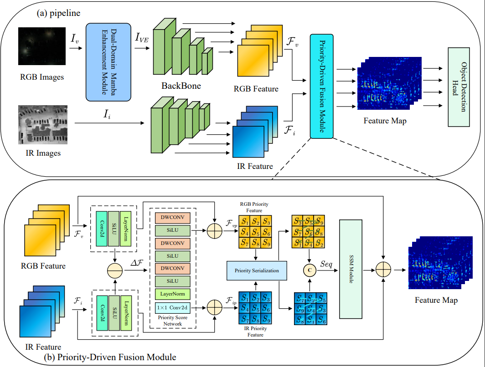

# 《DEPFusion: Dual-Domain Enhancement and Priority-Guided Mamba Fusion for UAV Multispectral Object Detection》



## Dataset
1. Download the dataset from the repository https://github.com/VisDrone/DroneVehicle, then run the following code to crop the white borders:
```shell
python tools/data_process.py
```

2. Run the following code to process the labels (since the original labels for the "freight-car" category are inconsistent and contain errors such as "*", we have unified them to "freight-car" in the code):
```shell
python tools/VOC2DOTA.py
```


## Envirenment
CUDA==11.8

Pytorch==2.1.2

mmcv==2.1.0

mmdet==3.3.0

mmengine==0.10.5

numpy==1.26.4

You can follow the steps below to create an virtual environment:

1. install all dependencies:
```
conda create -n depf python=3.10
conda activate depf

conda install pytorch==2.1.2 torchvision==0.16.2 torchaudio==2.1.2 pytorch-cuda=11.8 -c pytorch -c nvidia

pip install -U openmim
mim install mmdet
pip install numpy==1.26.4
```

- You might encounter the following, Downgrade the pip version to 24.0 (pip install pip==24.0)
```
Ignoring mmcv: markers 'extra == "mim"' don't match your environment
Ignoring mmengine: markers 'extra == "mim"' don't match your environment
```


2. Follow the https://github.com/MzeroMiko/VMamba Getting Started Step 2, install selective_scan==0.0.2


3. Clone the code and install:
```
git clone https://github.com/1BackStreet9/DEPF.git
cd DEPF
pip install -v -e .
```

## Run

1. train
```
Multi-GPUs:
bash dist_train.sh ${CONFIG_FILE} ${gpu_num} --cfg-options find_unused_parameters=True

Single GPU:
python ./tools/train.py ${CONFIG_FILE} 
```

2. test
```
Multi-GPUs:
bash dist_test.sh ${CONFIG_FILE} ${CHECKPOINT} ${gpu_num} --cfg-options find_unused_parameters=True

Single GPU:
python ./tools/test.py ${CONFIG_FILE} ${CHECKPOINT}
```


For more command-line arguments, please refer to the code details.

## Acknowledgment
Our codes are mainly based on [MMRotate](https://github.com/open-mmlab/mmrotate) and [VMamba](https://github.com/MzeroMiko/VMamba). Many thanks to the authors!

